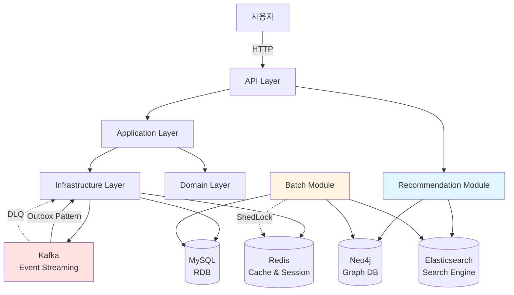
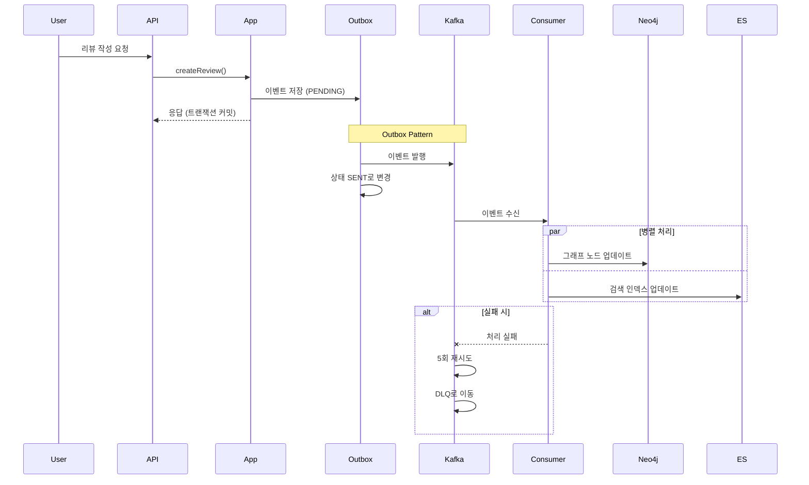

# 📚 BookVoyage

> 소셜 기반 독서 리뷰 플랫폼 + AI 추천 시스템

BookVoyage는 책 리뷰를 중심으로 한 소셜 플랫폼입니다. 사용자는 리뷰를 작성하고, 다른 사용자를 팔로우하며, 하이브리드 추천 시스템을 통해 개인화된 도서 및 리뷰를 추천받을 수 있습니다.

[](https://openjdk.java.net/projects/jdk/21/)
[](https://spring.io/projects/spring-boot)
[](LICENSE)

---

## 🎯 핵심 기능

### 📖 리뷰 & 소셜
- **리뷰 작성/수정/삭제** (Soft Delete)
- **공개 범위 설정** (Public / Private)
- **Markdown 지원** 리뷰 본문
- **댓글 및 대댓글** 트리 구조
- **리액션(좋아요)** 및 북마크
- **멘션(@username)** 기능
- **팔로우/언팔로우** 소셜 기능

### 🤖 추천 시스템
- **도서 추천** (7가지 알고리즘)
  - 협업 필터링 (User-based CF)
  - 장르/저자 기반 추천
  - 그래프 k-hop 유사 도서
  - More Like This (Elasticsearch)
  - 시맨틱 검색 추천
  - 인기 도서 추천

- **리뷰 추천** (5가지 알고리즘)
  - 피드용 맞춤 리뷰
  - 도서별 베스트 리뷰
  - 인기/최신 리뷰
  - 품질 기반 리뷰

- **하이브리드 스코어링**
  - 그래프 관계 40% + 시맨틱 30% + 참여도 15% + 인기도 10% + 최신성 5%
  - Redis 캐싱 (3시간 TTL)

### 🔔 알림 시스템
- **Kafka 기반 비동기 알림**
- **Outbox 패턴** 메시지 신뢰성 보장
- **DLQ (Dead Letter Queue)** 실패 메시지 처리
- **알림 설정** (ON/OFF 가능)
- **알림 유형**
  - 리뷰 리액션(좋아요, 댓글)
  - 멘션 알림
  - 팔로우한 사용자의 신규 리뷰

### 📊 통계 & 분석
- **리뷰 조회수 추적** (Redis 기반)
- **참여도 통계** (조회/좋아요/댓글 수)
- **인기 도서/리뷰 랭킹**
- **사용자 활동 분석**

### ⚙️ 배치 작업 (파생 인덱스 동기화)
- **Neo4j 동기화** (10분마다) - **MySQL → Neo4j 파생 그래프 인덱스 구축**
- **Elasticsearch 동기화** (30분마다) - **MySQL → ES 파생 검색 인덱스 구축**
- **리뷰 조회수 플러시** (15분마다) - Redis → MySQL 동기화
- **Outbox 정리** (매일 새벽 2시) - 7일 이상 오래된 이벤트 삭제
- **ShedLock 분산 락** - 중복 실행 방지

---

## 🏗️ 아키텍처

### 멀티모듈 헥사고날 아키텍처

```
bookvoyage/
├── api/                    # 🌐 REST API 엔드포인트 (Spring Boot 실행)
├── application/            # 💼 비즈니스 로직 (Use Cases, Ports)
├── domain/                 # 🧩 도메인 모델 (순수 비즈니스 규칙)
├── infrastructure/         # 🔧 외부 시스템 어댑터 (JPA, Kafka, Redis)
├── recommendation/         # 🤖 추천 시스템 (Neo4j, Elasticsearch)
├── batch/                  # ⏰ 배치 작업 (Spring Batch)
└── support/                # 🛠️ 공통 유틸리티 (JWT, Exception, Nickname)
```

### 시스템 아키텍처 다이어그램



### 이벤트 기반 아키텍처 (Event-Driven)



---

## 💾 데이터 아키텍처 원칙

### MySQL = Source of Truth

**BookVoyage는 MySQL을 단일 진실 공급원(Single Source of Truth)으로 사용합니다.**

```
┌─────────────────────────────────────────────────────────┐
│                    MySQL (SoT)                          │
│  - 모든 도메인 데이터의 유일한 원본 저장소                    │
│  - 모든 쓰기(Create/Update/Delete) 작업은 MySQL에만 수행    │
│  - 트랜잭션 일관성 및 ACID 보장                            │
└─────────────────────────────────────────────────────────┘
                           │
                           │ Batch Sync (10분~30분 주기)
                           ▼
        ┌──────────────────────────────────────┐
        │                                      │
        ▼                                      ▼
┌──────────────────┐              ┌──────────────────────┐
│   Neo4j          │              │   Elasticsearch      │
│ (파생 그래프 인덱스) │              │  (파생 검색 인덱스)     │
│                  │              │                      │
│ - Read-only      │              │ - Read-only          │
│ - 추천 시스템 전용  │              │ - 검색 & MLT 전용     │
└──────────────────┘              └──────────────────────┘
```

### 데이터 동기화 전략

1. **쓰기**: MySQL만 가능
   - 모든 비즈니스 로직은 MySQL에 먼저 기록
   - JPA 트랜잭션을 통한 데이터 무결성 보장

2. **읽기**: 목적에 따라 분산
   - **트랜잭션 조회**: MySQL (정확한 최신 데이터)
   - **그래프 분석**: Neo4j (관계 기반 추천)
   - **전문 검색**: Elasticsearch (텍스트 검색 및 유사도)

3. **동기화**: 배치 작업
   - **Neo4j 동기화**: 10분마다 (BatchSyncService)
   - **Elasticsearch 동기화**: 30분마다 (BatchSyncService)
   - **실패 처리**: 재시도 메커니즘 포함

4. **일관성 모델**: Eventual Consistency
   - 파생 인덱스는 최대 10-30분의 지연 가능
   - 실시간 정확도가 필요한 경우 MySQL 직접 조회

---

## 🛠️ 기술 스택

### Backend
- **Java 21** - 최신 LTS 버전
- **Spring Boot 4.0** - 웹 프레임워크
- **Spring Security** - OAuth2 + JWT 인증
- **Spring Data JPA** - ORM
- **Spring Batch** - 배치 작업
- **Spring Kafka** - 이벤트 스트리밍

### Database & Storage

#### 📌 Source of Truth (SoT)
- **MySQL 8.0** - **단일 진실 공급원 (Single Source of Truth)**
  - 모든 도메인 데이터의 원본 저장소
  - 트랜잭션 일관성 보장
  - 모든 쓰기 작업은 MySQL을 통해서만 수행

#### 🔄 Derived Indexes (파생 인덱스)
- **Neo4j 5.13** - **파생 그래프 인덱스**
  - MySQL 데이터를 배치 동기화하여 구축
  - 추천 시스템용 그래프 쿼리 최적화
  - 읽기 전용 (Read-only)

- **Elasticsearch 8.11** - **파생 검색 인덱스**
  - MySQL 데이터를 배치 동기화하여 구축
  - 전문 검색 및 텍스트 유사도 분석
  - 읽기 전용 (Read-only)

#### ⚡ Cache Layer
- **Redis 7** - 캐시 & 세션 & 분산 락

### Messaging & Events
- **Kafka** - 이벤트 스트리밍
- **Outbox Pattern** - 메시지 신뢰성
- **DLQ (Dead Letter Queue)** - 실패 메시지 처리

### DevOps & Tools
- **Docker & Docker Compose** - 컨테이너화
- **Gradle** - 빌드 도구
- **Jinx** - JPA 기반 DDL 생성 도구
- **ShedLock** - 분산 배치 락

### Libraries
- **dotenv-java** - 환경 변수 관리
- **Lombok** - 보일러플레이트 코드 제거
- **Jackson** - JSON 직렬화
- **Redisson** - Redis 분산 락

---

## 📂 모듈 상세

### 🌐 API Module
- **역할**: REST API 엔드포인트 제공
- **주요 컨트롤러**:
  - AuthController - 회원가입/로그인
  - ReviewController - 리뷰 CRUD
  - UserController - 사용자 프로필
  - NotificationController - 알림 조회

### 💼 Application Module
- **역할**: 비즈니스 유스케이스 구현
- **패턴**: Port & Adapter (Hexagonal Architecture)
- **주요 유스케이스**:
  - CreateReviewUseCase
  - FollowUserUseCase
  - SendNotificationUseCase

### 🧩 Domain Module
- **역할**: 순수 도메인 모델 및 비즈니스 규칙
- **주요 엔티티**:
  - User, Review, Book, Notification
  - 비밀번호 정책, 도메인 이벤트

### 🔧 Infrastructure Module
- **역할**: 외부 시스템 연동
- **구현**:
  - JPA Repositories
  - Kafka Producer/Consumer
  - Redis Operations
  - Outbox Processor

### 🤖 Recommendation Module
- **역할**: 추천 시스템 엔진 (읽기 전용)
- **데이터 소스**: MySQL의 파생 인덱스 활용
- **구성**:
  - **Candidate Generation**: Neo4j(파생 그래프) + Elasticsearch(파생 검색)
  - **Scoring**: 5가지 하이브리드 스코어러
  - **Caching**: Redis 기반 결과 캐싱
- **중요**: 추천 엔진은 데이터를 쓰지 않고, MySQL에서 동기화된 데이터만 읽음

### ⏰ Batch Module
- **역할**: 정기 배치 작업 및 **파생 인덱스 동기화**
- **작업 목록**:
  - **Neo4j 동기화** (10분) - **MySQL → Neo4j 단방향 동기화**
  - **Elasticsearch 동기화** (30분) - **MySQL → ES 단방향 동기화**
  - **리뷰 조회수 플러시** (15분) - Redis → MySQL 동기화
  - **Outbox 정리** (매일 새벽 2시) - 완료된 이벤트 삭제

### 🛠️ Support Module
- **역할**: 공통 유틸리티
- **제공 기능**:
  - JWT Provider
  - 닉네임 생성기
  - 예외 핸들러
  - 공통 응답 DTO

---

## 🎨 주요 설계 패턴

### Hexagonal Architecture (Port & Adapter)
```java
// Port (인터페이스)
public interface SaveReviewPort {
    Review save(Review review);
}

// Adapter (구현체)
@Component
public class ReviewPersistenceAdapter implements SaveReviewPort {
    // JPA 구현
}
```

### Outbox Pattern
```java
// 1. 비즈니스 로직 + Outbox 저장 (동일 트랜잭션)
@Transactional
public void createReview(ReviewCommand cmd) {
    Review review = reviewPort.save(cmd.toReview());
    outboxPort.save("review-created", event); // 같은 트랜잭션
}

// 2. OutboxProcessor가 별도로 Kafka로 발행
@Scheduled(fixedDelay = 1000)
public void processOutbox() {
    List<OutboxEvent> pending = outboxPort.findPending(100);
    pending.forEach(event -> kafkaTemplate.send(event));
}
```

### DLQ (Dead Letter Queue)
```java
@Bean
public DefaultErrorHandler errorHandler(KafkaTemplate template) {
    DeadLetterPublishingRecoverer recoverer =
        new DeadLetterPublishingRecoverer(template,
            (record, ex) -> new TopicPartition(record.topic() + ".DLT", ...)
        );
    return new DefaultErrorHandler(recoverer, new FixedBackOff(1000L, 5L));
}
```

### Repository Pattern with Specifications
```java
public interface ReviewRepository extends JpaRepository<ReviewEntity, Long>,
                                          JpaSpecificationExecutor<ReviewEntity> {
    // 복잡한 쿼리는 Specification으로 분리
}
```

---

## 📊 추천 시스템 개요

> **중요**: 추천 시스템은 **MySQL의 파생 인덱스**(Neo4j, Elasticsearch)를 활용합니다.
> 모든 추천 데이터는 MySQL에서 배치 동기화되며, 추천 엔진은 읽기 전용으로 동작합니다.

### 2-Stage 추천 파이프라인

**Stage 1: Candidate Generation (후보 생성)**
```
Neo4j (파생 그래프 인덱스): 협업 필터링 + 장르/저자 기반 → 250개
Elasticsearch (파생 검색 인덱스): MLT + 인기 도서 → 250개
────────────────────────────────────────────────────────────
합계: 500개 후보 (중복 제거 후)
```

**Stage 2: Scoring & Ranking (스코어링)**
```
HybridScorer =
  GraphScore(40%) + SemanticScore(30%) +
  EngagementScore(15%) + PopularityScore(10%) +
  FreshnessScore(5%)
```

**결과**: Top 50개를 Redis에 캐싱 (3시간)

### 지원하는 추천 기능

| 추천 유형 | 알고리즘 | 데이터 소스 |
|----------|---------|-----------|
| 협업 필터링 | User-based CF | Neo4j (파생 인덱스) |
| 장르 기반 | Content-based | Neo4j (파생 인덱스) |
| 저자 기반 | Content-based | Neo4j (파생 인덱스) |
| 유사 도서 | Graph k-hop | Neo4j (파생 인덱스) |
| More Like This | Text similarity | Elasticsearch (파생 인덱스) |
| 인기 도서 | Popularity-based | Elasticsearch (파생 인덱스) |
| 시맨틱 검색 | Text search | Elasticsearch (파생 인덱스) |

**데이터 원본**: 모든 추천 데이터는 **MySQL(SoT)**에서 배치 동기화됩니다.

---

## 🔒 보안

### 인증 방식
- **OAuth2 + JWT** 표준 인증 방식
- **Access Token** (1시간) + **Refresh Token** (2주)
- **Password Policy**: 최소 8자, 대소문자/숫자/특수문자 포함

### 비밀번호 정책
```java
// 도메인 계층에서 검증
PasswordPolicy.validate(password);
// → 8자 이상, 대문자, 소문자, 숫자, 특수문자(@$!%*?&) 각 1개 이상
```

### 환경 변수
- **JWT_SECRET**: 256비트 이상 시크릿 키
- **DB_PASSWORD**: 안전한 DB 비밀번호
- **.env 파일은 .gitignore 처리**

---

## ⚡ 성능 최적화

### 캐싱 전략
- **Redis**: 추천 결과, 세션, 리뷰 조회수
- **TTL**: 추천 3시간, 세션 2주

### 데이터베이스 최적화
- **JPA 인덱스**: `@Table(indexes = ...)`로 선언
- **N+1 문제 해결**: `@EntityGraph`, fetch join
- **배치 사이즈**: `spring.jpa.properties.hibernate.default_batch_fetch_size=100`

### Kafka 최적화
- **Consumer 동시성**: 환경 변수로 조정 가능 (기본 3)
- **배치 처리**: 100개씩 묶어서 처리
- **DLQ**: 5회 재시도 후 별도 토픽으로 이동

### 분산 락
- **Redisson**: 동시성 제어
- **ShedLock**: 배치 작업 중복 실행 방지

---

## 🛣️ 로드맵

### ✅ 완료된 기능
- [x] 기본 리뷰 CRUD
- [x] 소셜 기능 (팔로우, 멘션)
- [x] 알림 시스템 (Kafka)
- [x] Outbox 패턴 & DLQ
- [x] 추천 시스템 (도서/리뷰)
- [x] 배치 작업 (동기화, 정리)
- [x] Redis 캐싱
- [x] 비밀번호 정책

### 🚧 진행 중
- [ ] 추천 API 엔드포인트 구현
- [ ] A/B 테스트 프레임워크
- [ ] 성능 모니터링 대시보드

---
## 👥 팀

- 프로젝트 관리: [@yyubin](https://github.com/yyubin)
