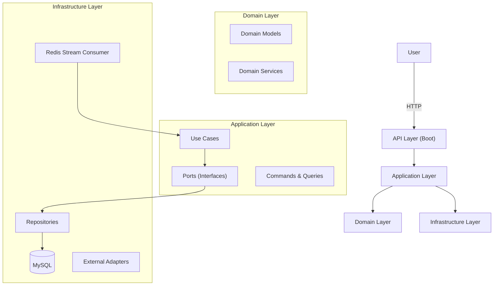

# BookVoyage

BookVoyage는 사용자가 작성한 책 리뷰를 중심으로, 팔로우·멘션·리액션·장르 기반 탐색·알림 등 소셜 기능을 제공하는 책 리뷰 플랫폼입니다.

---

## 주요 기능

### 리뷰 & 댓글

* 리뷰 작성 / 수정 / 삭제(Soft Delete)
* 공개 범위 설정(Private / Public)
* Markdown 기반 리뷰 본문 작성
* 댓글 및 대댓글 지원

### 리액션 & 장르

* 리뷰 리액션(이모지 기반 리액션 제외)
* 리뷰별 장르 태깅 및 필터링

### 사용자 기능

* 프로필 이미지, 닉네임, Bio 수정
* 닉네임 랜덤 생성 기능
* 팔로우 / 언팔로우
* 멘션(@username) 기능

### 알림(Notification)

Redis Streams 기반 비동기 알림 처리

* 리뷰에 대한 반응(좋아요/댓글)
* 멘션 발생 시 알림
* 팔로우한 사용자의 신규 리뷰 알림
* 알림 설정(ON/OFF) 기능 제공

---

## 아키텍처 개요

BookVoyage는 헥사고날 아키텍처를 기반으로 멀티모듈 구조로 구성됩니다. `api` 모듈이 애플리케이션의 부트스트랩 역할을 담당합니다.

### 모듈 구조

```
bookvoyage
 ├── api               # Controller 계층 + Spring Boot 실행 지점 (부트 모듈)
 ├── application       # UseCase, Command, Query, Port 등 애플리케이션 로직
 ├── domain            # 엔티티/값객체/도메인 서비스 (순수 비즈니스 계층)
 ├── infrastructure    # JPA, Redis Streams, Repository 구현체, 외부 어댑터
 └── support           # 공용 모듈 (Exception, Utils, 공통 응답 등)
```

### 아키텍처 다이어그램



---

## 기술 스택

* Java 21+
* Spring Boot 4
* Spring Data JPA
* Spring Security
* Jinx
* MySQL
* Redis Streams
* Docker / Docker Compose
* Gradle

---

## 프로젝트 목표

* 리뷰 기반의 소셜 플랫폼 구축
* 비동기 이벤트 및 실시간 알림 구조 설계
* 도메인 중심 설계(DDD) 적용 및 구조적 확장성 확보
* 향후 추천 시스템 구현 기반 마련(장르/키워드/팔로우 기반 추천)
* 높은 RPS를 견딜 수 있는 구조 설계 및 성능 최적화 실험 목표
