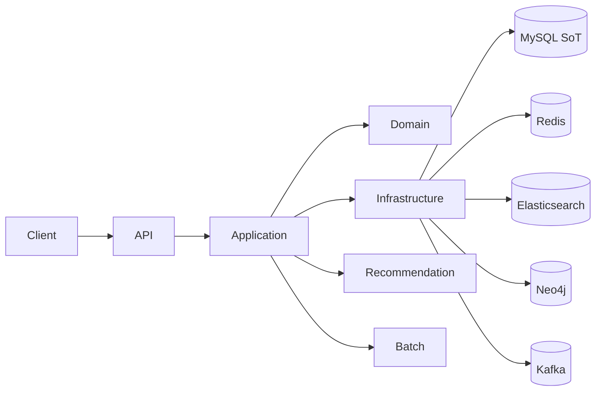

# 📚 BookVoyage

> 소셜 기반 독서 리뷰 플랫폼 + 하이브리드 추천 시스템

BookVoyage는 책 리뷰를 중심으로 한 소셜 플랫폼입니다. 사용자는 리뷰를 작성하고, 다른 사용자를 팔로우하며, **Neo4j 그래프 + Elasticsearch 텍스트 분석**을 결합한 하이브리드 추천 시스템을 통해 개인화된 도서 및 리뷰를 추천받을 수 있습니다.

[](https://openjdk.java.net/projects/jdk/21/)
[](https://spring.io/projects/spring-boot)
[](LICENSE)

---

## 포트폴리오 하이라이트

- 45분 부하 테스트에서 **KO 2009 → 0** 달성 (Gatling 리포트 기반)
- Outbox 쓰기 트래픽을 **전용 커넥션 풀**로 분리해 경합 완화
- Kakao Books **rate limit 대응 캐싱** 도입
- JFR/프로파일링 리포트로 병목 원인 확인 → 개선 적용
- 실제 배포 환경(FE+BE, 커스텀 도메인/OAuth2 포함)에서 촬영한 데모 영상: https://www.youtube.com/watch?v=GIzRyLRbyuE

[](https://www.youtube.com/watch?v=GIzRyLRbyuE)


### 성능 근거 링크
- Gatling 리포트: `performance-test/build/reports/gatling/fullexperimentsimulation-20260124020335657/index.html`
- KO 분석 문서: [성능 개선 포스트 바로가기](https://cassidycodes.vercel.app/articles/bookvoyage-performance-improvement-report)
- 프로파일링 리포트: `performance-test/reports/profiling`
- 배치 성능 개선 기록: [성능 개선 포스트 바로가기](https://cassidycodes.vercel.app/articles/bookvoyage-performance-improvement-report)

### 성능 요약 (발췌)
| 항목 | 결과 | 근거                                                       |
| --- | --- |----------------------------------------------------------|
| 45분 부하 테스트 KO | 2009 → 0 | [성능 개선 포스트 바로가기](https://cassidycodes.vercel.app/articles/bookvoyage-performance-improvement-report)                                              |
| 전체 요청 p95/p99 | 85ms / 106ms | `performance-test/reports/profiling/global_stats.json`   |
| Outbox 쓰기 경합 완화 | 전용 커넥션 풀 분리 | [성능 개선 포스트 바로가기](https://cassidycodes.vercel.app/articles/bookvoyage-performance-improvement-report) |
| 외부 API 제한 대응 | Kakao 캐싱 도입 | [성능 개선 포스트 바로가기](https://cassidycodes.vercel.app/articles/bookvoyage-performance-improvement-report) |


## 주요 특징

- 🎯 **헥사고날 아키텍처** - 도메인 중심 멀티모듈 설계
- 🤖 **2-Stage 하이브리드 추천** - Neo4j 그래프 + Elasticsearch 검색
- 🔄 **파생 인덱스 아키텍처** - MySQL을 단일 진실 공급원(SoT)으로 활용
- 🔒 **안전한 인증** - JWT + HttpOnly 쿠키 + 블랙리스트
- 📊 **이벤트 기반 아키텍처** - Kafka + Outbox 패턴 + DLQ
- ⚡ **성능 최적화** - Redis 캐싱 + 배치 동기화

---

## 핵심 기능

### 📖 리뷰 & 소셜
- 리뷰 작성/수정/삭제 (Soft Delete)
- 공개 범위 설정 (Public/Private)
- 댓글 및 대댓글 트리 구조
- 리액션(좋아요) 및 북마크
- 멘션(@username) 및 팔로우/언팔로우

### 📚 책 검색 & 웹소설 지원
- **멀티 소스 전략**: 카카오 책 API → Google Books API fallback
- **한국 도서 우선**: 카카오 API로 국내 도서 데이터 확보
- **풍부한 메타데이터**: ISBN, 저자, 출판사, 표지 이미지 등

### 🤖 추천 시스템
- **도서 추천**: 협업 필터링, 장르/저자 기반, 그래프 유사도, MLT, 인기도
- **리뷰 추천**: 맞춤 피드, 베스트 리뷰, 품질 기반
- **하이브리드 스코어링**: 그래프(40%) + 시맨틱(30%) + 참여도(15%) + 인기도(10%) + 최신성(5%)
- **개인화**: 실시간 이벤트 트래킹, 커서 페이지네이션, 윈도우 샘플링

### 🔐 인증 & 보안
- JWT 기반 인증 (Access + Refresh Token)
- HttpOnly 쿠키 (XSS 방지)
- JWT 블랙리스트 (Redis 기반 토큰 무효화)
- OAuth2 소셜 로그인 (Google)
- 비밀번호 정책 (8자 이상, 대소문자/숫자/특수문자)

### ⚙️ 배치 작업
- **Neo4j 동기화** (10분) - MySQL → Neo4j 파생 그래프 인덱스
- **Elasticsearch 동기화** (30분) - MySQL → ES 파생 검색 인덱스
- **리뷰 조회수 플러시** (15분) - Redis → MySQL
- **Outbox 정리** (매일 새벽 2시)
- ShedLock 분산 락으로 중복 실행 방지

---

## 빠른 시작

### 사전 요구사항
- Java 21
- Docker & Docker Compose
- Git

### 설치 및 실행

1. **프로젝트 클론**
   ```bash
   git clone https://github.com/yyubin/bookvoyage.git
   cd bookvoyage
   ```

2. **환경 변수 설정**
   ```bash
   cp .env.example .env
   # JWT 시크릿 생성
   openssl rand -base64 32
   # .env 파일 편집하여 필수 값 설정:
   # - JWT_SECRET: JWT 시크릿 키
   # - DB_USERNAME, DB_PASSWORD: 데이터베이스 계정
   # - KAKAO_BOOKS_API_KEY: 카카오 REST API 키 (https://developers.kakao.com/)
   # - GOOGLE_BOOKS_API_KEY: Google Books API 키 (선택)
   ```

3. **인프라 실행**
   ```bash
   docker-compose up -d
   ```

4. **애플리케이션 실행**
   ```bash
   ./gradlew :api:bootRun
   ```

5. **API 문서 확인**
   - Redoc: http://localhost:8080/redoc.html
   - Swagger: http://localhost:8080/swagger-ui.html

6. **초기 데이터 동기화**
   ```bash
   # Neo4j 동기화 (추천 시스템)
   curl -X POST http://localhost:8080/api/admin/batch/sync-neo4j

   # Elasticsearch 동기화 (검색)
   curl -X POST http://localhost:8080/api/admin/batch/sync-elasticsearch
   ```
---

## 기술 스택

### Backend
- **Java 21** + **Spring Boot 4.0**
- **Spring Security** (OAuth2 + JWT)
- **Spring Data JPA** + **Spring Batch** + **Spring Kafka**

### Database & Storage
- **MySQL 8.0** - 단일 진실 공급원 (Source of Truth)
- **Neo4j 5.13** - 파생 그래프 인덱스 (추천 시스템)
- **Elasticsearch 8.11** - 파생 검색 인덱스 (전문 검색)
- **Redis 7** - 캐시 & 세션 & 분산 락

### Messaging & Events
- **Kafka** - 이벤트 스트리밍
- **Outbox Pattern** - 메시지 신뢰성
- **DLQ** - 실패 메시지 처리

### DevOps
- **Docker & Docker Compose**
- **Gradle** - 빌드 도구
- **ShedLock** - 분산 배치 락
- **SpringDoc OpenAPI 3** - API 문서
- **AWS(EC2 / S3 / Route53)**
- **Vercel** 

---

## 아키텍처

### 상위 흐름


### 멀티모듈 구조
```
bookvoyage/
├── api/            # REST API 엔드포인트
├── application/    # 비즈니스 로직 (Use Cases, Ports)
├── domain/         # 도메인 모델 (순수 비즈니스 규칙)
├── infrastructure/ # 외부 시스템 어댑터 (JPA, Kafka, Redis)
├── recommendation/ # 추천 시스템 (Neo4j, Elasticsearch)
├── batch/          # 배치 작업 (Spring Batch)
└── support/        # 공통 유틸리티 (JWT, Exception)
```

### 데이터 아키텍처
```
MySQL (SoT) → 모든 쓰기 작업
    ↓
    ├── Neo4j (파생 인덱스) → 추천 시스템 (읽기 전용)
    └── Elasticsearch (파생 인덱스) → 검색 엔진 (읽기 전용)
```

자세한 내용은 [아키텍처 문서](./docs/architecture.md)를 참고하세요.

---

## 문서

### 핵심 문서
- [🏗️ 아키텍처](./docs/architecture.md) - 시스템 구조 및 기술 스택
- [🤖 추천 시스템](./docs/recommendation-system.md) - 2-Stage 하이브리드 추천
- [🔎 리뷰 검색](./docs/review-search.md) - ES 기반 리뷰 검색 상세
- [🧠 AI 추천](./docs/ai-book-recommendation.md) - 취향 분석/추천 설명 흐름
- [💾 데이터베이스](./docs/database.md) - MySQL 중심 파생 인덱스 구조
- [🔒 보안](./docs/security.md) - JWT 인증 및 보안 정책
- [📦 모듈 구조](./docs/modules.md) - 헥사고날 아키텍처 모듈 상세
- [🎨 설계 패턴](./docs/design-patterns.md) - Outbox, DLQ, Repository
- [⚡ 성능 최적화](./docs/performance.md) - 캐싱, 인덱싱, 분산 락

### API 문서 (실행 후 접속)
- **Redoc UI**: http://localhost:8080/redoc.html (권장)
- **Swagger UI**: http://localhost:8080/swagger-ui.html
- **OpenAPI JSON**: http://localhost:8080/api-docs

---

## 팀

- [@yyubin](https://github.com/yyubin)
