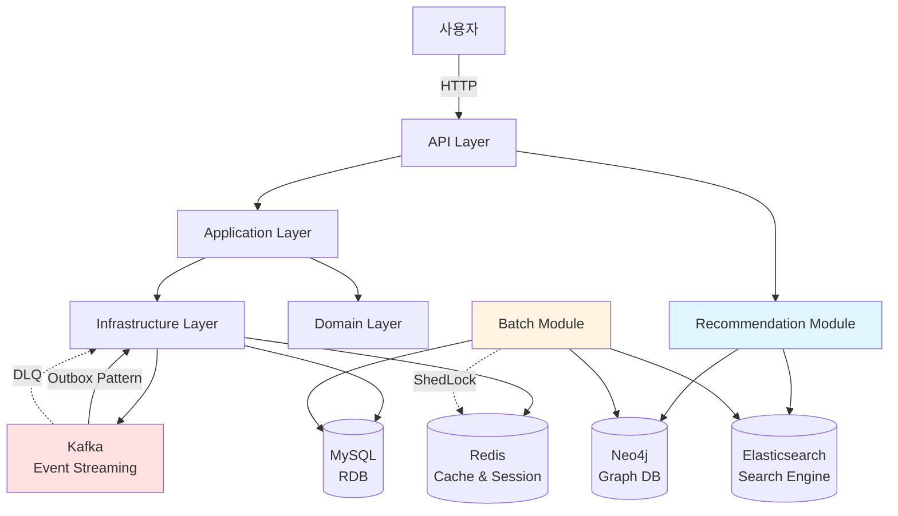
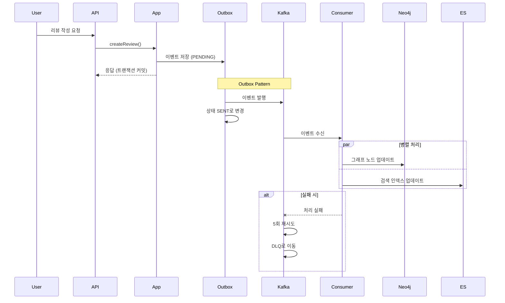

# 시스템 아키텍처

## 멀티모듈 헥사고날 아키텍처

```
bookvoyage/
├── api/                    # 🌐 REST API 엔드포인트 (Spring Boot 실행)
├── application/            # 💼 비즈니스 로직 (Use Cases, Ports)
├── domain/                 # 🧩 도메인 모델 (순수 비즈니스 규칙)
├── infrastructure/         # 🔧 외부 시스템 어댑터 (JPA, Kafka, Redis)
├── recommendation/         # 🤖 추천 시스템 (Neo4j, Elasticsearch)
├── batch/                  # ⏰ 배치 작업 (Spring Batch)
└── support/                # 🛠️ 공통 유틸리티 (JWT, Exception, Nickname)
```

## 시스템 아키텍처 다이어그램



## 이벤트 기반 아키텍처 (Event-Driven)



## 아키텍처 원칙

### Hexagonal Architecture (Port & Adapter)
- **도메인 계층**을 외부 의존성으로부터 격리
- **Port**: 인터페이스로 비즈니스 로직과 외부 시스템 간의 계약 정의
- **Adapter**: Port 구현체로 실제 외부 시스템 연동

### 계층별 역할

#### Domain Layer
- 순수 비즈니스 규칙 및 엔티티
- 외부 의존성 없음
- 도메인 이벤트 정의

#### Application Layer
- 유스케이스 구현
- Port 정의 (인터페이스)
- 비즈니스 로직 조율

#### Infrastructure Layer
- Adapter 구현 (JPA, Kafka, Redis)
- 외부 시스템과의 실제 통신
- 기술적 세부사항 처리

#### API Layer
- REST API 엔드포인트
- 요청/응답 DTO 변환
- 인증/인가 처리

## 기술 스택

### Backend
- **Java 21** - 최신 LTS 버전
- **Spring Boot 4.0** - 웹 프레임워크
- **Spring Security** - OAuth2 + JWT 인증
- **Spring Data JPA** - ORM
- **Spring Batch** - 배치 작업
- **Spring Kafka** - 이벤트 스트리밍

### Database & Storage

#### Source of Truth (SoT)
- **MySQL 8.0** - 단일 진실 공급원
  - 모든 도메인 데이터의 원본 저장소
  - 트랜잭션 일관성 보장
  - 모든 쓰기 작업은 MySQL을 통해서만 수행

#### Derived Indexes (파생 인덱스)
- **Neo4j 5.13** - 파생 그래프 인덱스
  - MySQL 데이터를 배치 동기화하여 구축
  - 추천 시스템용 그래프 쿼리 최적화
  - 읽기 전용 (Read-only)

- **Elasticsearch 8.11** - 파생 검색 인덱스
  - MySQL 데이터를 배치 동기화하여 구축
  - 전문 검색 및 텍스트 유사도 분석
  - 읽기 전용 (Read-only)

#### Cache Layer
- **Redis 7** - 캐시 & 세션 & 분산 락

### Messaging & Events
- **Kafka** - 이벤트 스트리밍
- **Outbox Pattern** - 메시지 신뢰성
- **DLQ (Dead Letter Queue)** - 실패 메시지 처리

### DevOps & Tools
- **Docker & Docker Compose** - 컨테이너화
- **Gradle** - 빌드 도구
- **Jinx** - JPA 기반 DDL 생성 도구
- **ShedLock** - 분산 배치 락
- **SpringDoc OpenAPI 3** - API 문서 자동 생성
- **Redoc & Swagger UI** - 대화형 API 문서

### Libraries
- **dotenv-java** - 환경 변수 관리
- **Lombok** - 보일러플레이트 코드 제거
- **Jackson** - JSON 직렬화
- **Redisson** - Redis 분산 락
